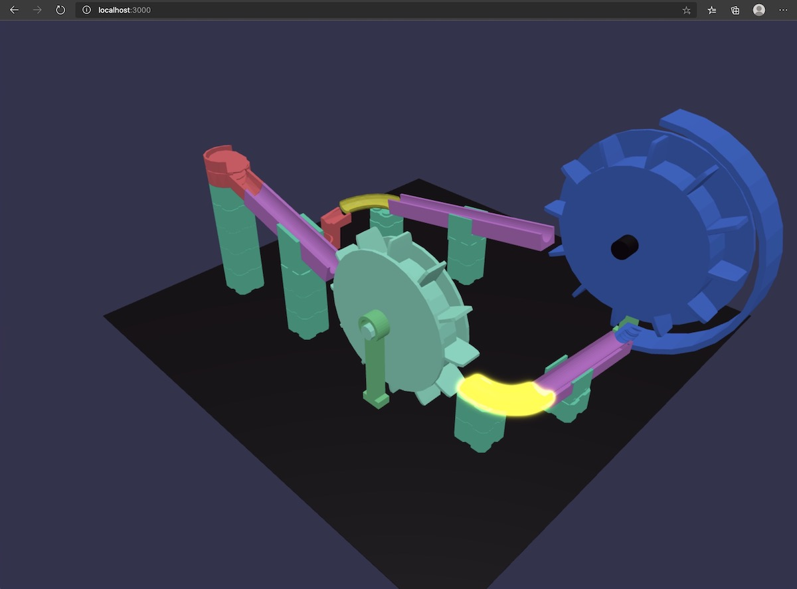

# A ES6 based example on Babylon.js

  

# Background

Basic example for ES6 and Babylon.js. Most of code are based on [ES6 usage on Babylon.js official document](https://doc.babylonjs.com/features/es6_support).  

# Feature

The following two simple modules has been added.

1. ImportModel.importMeshModel()  

```
./src/ImportModel.js
```

2. Effects.add()  

```
./src/Effects.js
```

# Usage

1. npm install  

```bash
npm install webpack webpack-cli webpack-dev-server
```

2. run webpack-dev-server

```bash
$ npx webpack-dev-server
```

3. Access the URL

http://localhost:3000
